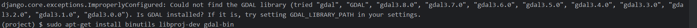

### 1、出现bug


安装依赖包（一个地理空间数据抽象库）
```bash
sudo apt-get install binutils libproj-dev gdal-bin
```
又出现bug
>OSError: /home/lhf/miniconda3/envs/project/bin/../lib/libstdc++.so.6: version `GLIBCXX_3.4.30' not found (required by /lib/libgdal.so.30)

建立软连接
```bash
strings /usr/lib/x86_64-linux-gnu/libstdc++.so.6 | grep GLIBCXX
cd /home/lhf/miniconda3/envs/project/bin/../lib/
mv libstdc++.so.6 libstdc++.so.6.old
ln -s /usr/lib/x86_64-linux-gnu/libstdc++.so.6 libstdc++.so.6
```
### 2、创建admin的超级管理员
```bash
python manage.py createsuperuser
```