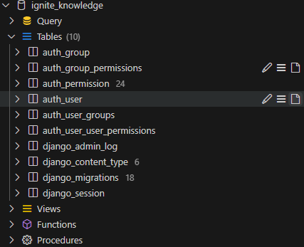

## 1、项目初始化
创建项目：
```bash
django-admin startproject ignite_knowledge
```
创建应用：
```bash
python manage.py startapp notes
python manage.py startapp llm_app
```

## 2、数据库配置
此处，我们选择是mysql数据库，安装在我wsl(ubuntu 22.04)上，版本是8.0。

```python
DATABASES = {
    'default': {
        'ENGINE': 'django.db.backends.mysql',
        'NAME': 'ignite_knowledge',
        'USER': 'lhf',
        'PASSWORD': '123456',
        'HOST': '127.0.0.1',
        'PORT': '3306',
    }
}
```
之后就是做数据库变换的迁移
```bash
python manage.py makemigrations

python manage.py migrate
```
在数据库里就可以看到如下变换

